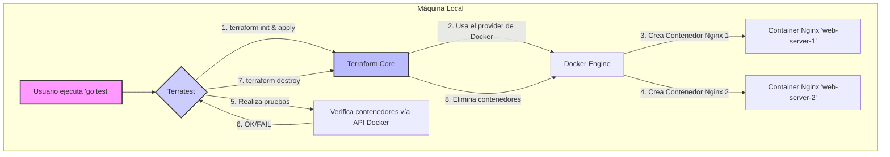

# Laboratorio Local de Terraform y Terratest con Docker 🐳

Este proyecto demuestra cómo construir y probar infraestructura como código (IaC) en un entorno local utilizando **Terraform** para la definición de la infraestructura, **Docker** como proveedor local y **Terratest** para las pruebas automatizadas.

La configuración es modular, lo que permite reutilizar y gestionar los componentes de la infraestructura de manera eficiente.

---

## 🤔 ¿Por qué este enfoque?

- **Aprendizaje sin costo:** Permite experimentar con Terraform y Terratest sin necesidad de una cuenta en un proveedor de nube (AWS, GCP, Azure), eliminando cualquier riesgo de facturación inesperada.
- **Desarrollo rápido y local:** Probar los cambios de infraestructura en tu propia máquina es mucho más rápido que desplegarlos en un entorno de nube remoto. Esto acelera el ciclo de desarrollo y depuración.
- **Pruebas de confianza:** Implementa un flujo de **Pruebas de Infraestructura**, donde puedes verificar que tu código de Terraform funciona como se espera antes de aplicarlo en producción.
- **Modularidad y reutilización:** Organizar el código de Terraform en módulos es una buena práctica que fomenta la reutilización, la mantenibilidad y la escalabilidad de tus proyectos de IaC.

---

## 🛠️ Tecnologías Utilizadas

- **Terraform:** Herramienta de código abierto para construir, cambiar y versionar infraestructura de manera segura y eficiente.
- **Terratest:** Biblioteca de Go para escribir pruebas automatizadas para tu código de infraestructura.
- **Docker:** Plataforma para desarrollar, enviar y ejecutar aplicaciones en contenedores. Actúa como nuestro "proveedor de nube" local.
- **Go:** Lenguaje de programación utilizado para escribir las pruebas de Terratest.

---

## 🐳 Implementación con Dev Container

Este proyecto incluye una configuración lista para usar con [VS Code Dev Containers](https://code.visualstudio.com/docs/devcontainers/containers).  
Esto te permite desarrollar y probar en un entorno reproducible, con todas las herramientas necesarias preinstaladas (Go, Docker, Terraform, kubectl, Helm, Minikube, etc).

### ¿Cómo usar el Dev Container?

1. **Abre el proyecto en VS Code.**
2. Si tienes la extensión "Dev Containers" instalada, VS Code te sugerirá "Reopen in Container". Haz clic ahí.
3. Espera a que se construya el contenedor (esto puede tardar la primera vez).
4. ¡Listo! Ya puedes correr todos los comandos y pruebas dentro del entorno aislado.

**Ventajas:**
- Docker-in-Docker ya está configurado, puedes usar `docker` directamente.
- Incluye kubectl, Helm y Minikube para pruebas de Kubernetes.
- El usuario y permisos están preconfigurados para desarrollo.

**Ejemplo de comandos útiles dentro del devcontainer:**
```bash
go test -v
docker ps
kubectl version
minikube status
```

**Abrir Nginx en tu navegador desde el devcontainer:**
```bash
$BROWSER http://localhost:8081
```

---

## 🚀 Guía de Implementación

### Requisitos Previos

- [Docker](https://www.docker.com/products/docker-desktop)
- [Visual Studio Code](https://code.visualstudio.com/) + [Dev Containers extension](https://marketplace.visualstudio.com/items?itemName=ms-vscode-remote.remote-containers)
- [Terraform](https://learn.hashicorp.com/tutorials/terraform/install-cli) (opcional si usas el devcontainer)
- [Go (versión 1.18+)](https://golang.org/doc/install) (opcional si usas el devcontainer)

### Pasos para la Ejecución

1. **Clona el repositorio:**
    ```bash
    git clone <URL-del-repositorio>
    cd terraform-docker-modular-lab
    ```

2. **Abre el proyecto en VS Code y entra al Dev Container.**

3. **Inicializa el módulo de Go (solo la primera vez):**
    ```bash
    cd test
    go mod tidy
    ```

4. **Ejecuta las pruebas:**
    ```bash
    go test -v
    ```

---

## 🧑‍💻 Guía para Implementar en tu Proyecto

1. **Copia la estructura de carpetas** (`terraform`, `test`, etc.) a tu repositorio.
2. **Adapta los módulos de Terraform** según tus necesidades (puertos, imágenes, variables).
3. **Modifica o agrega pruebas en Go** en el directorio `test` para validar los recursos que implementes.
4. **Ejecuta las pruebas localmente** con `go test -v` antes de hacer push.
5. **Integra el flujo en tu CI/CD** (GitHub Actions, GitLab CI, etc.) para validar cada cambio automáticamente.

---

## ✅ Resultados Esperados

Al ejecutar `go test`, deberías observar el siguiente flujo en tu terminal:

1. Terratest invoca a `terraform init` y `terraform apply`.
2. Terraform, usando el módulo `nginx_container`, crea dos contenedores Docker de Nginx:
    - `web-server-1` expuesto en el puerto `8081`.
    - `web-server-2` expuesto en el puerto `8082`.
3. Terratest realiza una petición HTTP a `http://localhost:8081` y `http://localhost:8082` para verificar que los servidores Nginx responden correctamente.
   - **La validación solo comprueba que el código de estado HTTP sea 200, sin importar el contenido del body.**
4. La prueba confirma que los nombres de los contenedores son los esperados.
5. Finalmente, Terratest invoca a `terraform destroy` para eliminar los contenedores y limpiar el entorno.
6. La salida de la prueba mostrará **`PASS`**, indicando que todo funcionó correctamente.

---

## ❌ Casos Comunes de Error

- **Docker no está corriendo:**  
  El test fallará con errores de conexión. Solución: asegúrate de que el servicio Docker esté activo (`sudo systemctl start docker` o abre Docker Desktop).

- **El puerto ya está en uso:**  
  Si tienes otro servicio usando el puerto 8081 o 8082, Terraform fallará al crear el contenedor. Solución: libera los puertos o cambia los valores en las variables de Terraform.

- **No tienes permisos para usar Docker:**  
  Verás errores de permisos. Solución: agrega tu usuario al grupo `docker` o ejecuta con `sudo`.

- **Fallo en la prueba HTTP:**  
  Si el contenedor Nginx no inicia correctamente, la prueba de Terratest fallará tras varios reintentos. Solución: revisa los logs del contenedor con `docker logs <container_id>`.

- **Variables o archivos faltantes:**  
  Si falta `terraform.tfvars` o alguna variable obligatoria, Terraform fallará. Solución: revisa que todos los archivos requeridos estén presentes.

- **Problemas con Go Modules:**  
  Si ves errores de dependencias, ejecuta `go mod tidy` en el directorio `test`.

- **Problemas en CI/CD:**  
  Si tu pipeline falla, revisa que el runner tenga Docker y permisos para crear contenedores.

---

## 🧪 Ejemplo de Personalización

¿Quieres agregar más servidores o cambiar los puertos?  
Edita el archivo [`terraform/terraform.tfvars`](terraform/terraform.tfvars):

```hcl
servers = {
  "web-server-1" = { port = 8081 }
  "web-server-2" = { port = 8082 }
  "web-server-3" = { port = 8083 } # Nuevo servidor
}
```

---

## 📦 Estructura del Proyecto

```
terratest_lab/
├── modules/
│   └── nginx_container/
├── terraform/
│   ├── main.tf
│   ├── variables.tf
│   └── terraform.tfvars
├── test/
│   ├── main_test.go
│   └── go.mod
├── .github/
│   └── workflows/
│       └── ci.yml
├── .devcontainer/
│   ├── devcontainer.json
│   ├── docker-compose.yml
│   └── Dockerfile
├── README.md
└── ...
```

---

## 📈 Diagrama del Flujo



---

## 📚 Recursos Útiles

- [Documentación de Terraform](https://www.terraform.io/docs)
- [Terratest Examples](https://github.com/gruntwork-io/terratest/tree/master/examples)
- [Documentación de Docker](https://docs.docker.com/)
- [Go Modules](https://blog.golang.org/using-go-modules)
- [Dev Containers](https://containers.dev/)

---

## 🙋‍♂️ Preguntas Frecuentes

**¿Puedo usar otros contenedores además de Nginx?**  
Sí, solo adapta el módulo y las variables para la imagen que desees.

**¿Puedo correr esto en Windows/Mac?**  
Sí, siempre que tengas Docker, Go y Terraform instalados, o uses el Dev Container.

**¿Cómo abro la web de Nginx desde el contenedor dev?**  
Usa:  
```bash
$BROWSER http://localhost:8081
```
o  
```bash
$BROWSER http://localhost:8082
```

---

## 📝 Licencia

MIT License.  
¡Úsalo, modifícalo y comparte!

---