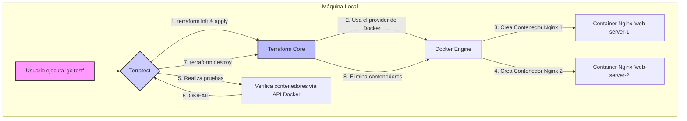

# Laboratorio Local de Terraform y Terratest con Docker 🐳

Este proyecto demuestra cómo construir y probar infraestructura como código (IaC) en un entorno local utilizando **Terraform** para la definición de la infraestructura, **Docker** como proveedor local y **Terratest** para las pruebas automatizadas.

La configuración es modular, lo que permite reutilizar y gestionar los componentes de la infraestructura de manera eficiente.

---

## 🤔 ¿Por qué este enfoque?

- **Aprendizaje sin costo:** Permite experimentar con Terraform y Terratest sin necesidad de una cuenta en un proveedor de nube (AWS, GCP, Azure), eliminando cualquier riesgo de facturación inesperada.
- **Desarrollo rápido y local:** Probar los cambios de infraestructura en tu propia máquina es mucho más rápido que desplegarlos en un entorno de nube remoto. Esto acelera el ciclo de desarrollo y depuración.
- **Pruebas de confianza:** Implementa un flujo de **Pruebas de Infraestructura**, donde puedes verificar que tu código de Terraform funciona como se espera antes de aplicarlo en producción.
- **Modularidad y reutilización:** Organizar el código de Terraform en módulos es una buena práctica que fomenta la reutilización, la mantenibilidad y la escalabilidad de tus proyectos de IaC.

---

## 🛠️ Tecnologías Utilizadas

- **Terraform:** Herramienta de código abierto para construir, cambiar y versionar infraestructura de manera segura y eficiente.
- **Terratest:** Biblioteca de Go para escribir pruebas automatizadas para tu código de infraestructura.
- **Docker:** Plataforma para desarrollar, enviar y ejecutar aplicaciones en contenedores. Actúa como nuestro "proveedor de nube" local.
- **Go:** Lenguaje de programación utilizado para escribir las pruebas de Terratest.

---

## 🚀 Guía de Implementación

### Requisitos Previos

- [Docker](https://www.docker.com/products/docker-desktop)
- [Terraform](https://learn.hashicorp.com/tutorials/terraform/install-cli)
- [Go (versión 1.18+)](https://golang.org/doc/install)

### Pasos para la Ejecución

1. **Clona el repositorio:**
    ```bash
    git clone <URL-del-repositorio>
    cd terraform-docker-modular-lab
    ```

2. **Inicializa el módulo de Go:**
    ```bash
    cd test
    go mod init terraform-docker-modular-lab/test
    go mod tidy
    ```

3. **Ejecuta las pruebas:**
    ```bash
    go test -v
    ```

---

## 🔄 Flujo del Pipeline

El workflow se activa con cada `push` o `pull request` a la rama `main` y realiza los siguientes pasos en un entorno limpio de GitHub:

1. **Configuración del Entorno:**
    - Prepara una máquina virtual con Ubuntu.
    - Descarga el código del repositorio.
    - Instala las versiones correctas de Go y Terraform.

2. **Ejecución de Pruebas:**
    - Navega al directorio `/test`.
    - Ejecuta `go test`. Este comando le ordena a Terratest que:
        1. Invoque `terraform apply` para crear los contenedores Docker definidos en el directorio `/terraform`.
        2. Realice las pruebas unitarias escritas en Go (verificar que los servidores responden).
        3. Invoque `terraform destroy` para limpiar todos los recursos, sin importar si las pruebas tuvieron éxito o fallaron.

---

## ⚙️ ¿Cómo funciona?

Cuando se activa el workflow, puedes ir a la pestaña **"Actions"** de tu repositorio de GitHub para ver la ejecución en tiempo real. Si todos los pasos se completan con éxito, verás una marca de verificación verde ✅. Si alguna prueba falla, verás una cruz roja ❌, lo que te permitirá saber que tus cambios han roto la infraestructura sin necesidad de probarlos manualmente.

Este ciclo automatizado asegura que cada cambio en el código de Terraform sea validado, aumentando la confianza y la estabilidad de la infraestructura.

---

## ✅ Resultados Esperados

Al ejecutar `go test`, deberías observar el siguiente flujo en tu terminal:

1. Terratest invoca a `terraform init` y `terraform apply`.
2. Terraform, usando el módulo `nginx_container`, crea dos contenedores Docker de Nginx:
    - `web-server-1` expuesto en el puerto `8081`.
    - `web-server-2` expuesto en el puerto `8082`.
3. Terratest realiza una petición HTTP a `http://localhost:8081` y `http://localhost:8082` para verificar que los servidores Nginx responden correctamente.
4. La prueba confirma que los nombres de los contenedores son los esperados.
5. Finalmente, Terratest invoca a `terraform destroy` para eliminar los contenedores y limpiar el entorno.
6. La salida de la prueba mostrará **`PASS`**, indicando que todo funcionó correctamente.

---

## 📈 Diagrama del Flujo

